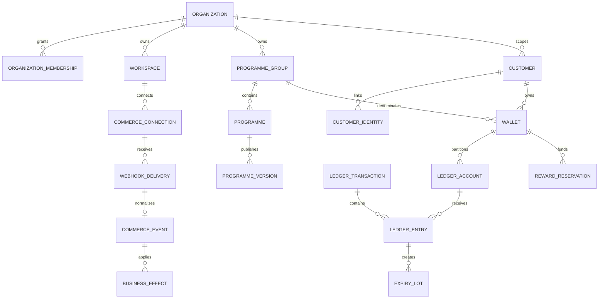

# Data Model

## Database boundaries

- `loyalty` is the candidate Data API schema. It is not exposed or granted by default. Every table has RLS enabled and forced where ownership permits.
- `loyalty_private` contains privileged functions, webhook bodies, internal queues, projection machinery, and operational metadata. It is never listed in PostgREST schemas and grants nothing to `anon` or `authenticated`.
- `auth` remains owned by Supabase Auth. Starfiniti references `auth.users(id)` but does not edit Auth tables directly.
- `public` contains no Starfiniti tenant tables. Extension objects remain in `extensions`.

## Identifier and tenant strategy

- Internal relational keys use `bigint generated always as identity` for compact indexes and predictable lock ordering.
- Externally visible resources also receive a random UUID `public_id` with a unique constraint. UUIDs are not used as the high-volume clustered primary key.
- High-volume tenant rows store `organization_id` directly. Composite foreign keys such as `(organization_id, wallet_id)` prevent a forged tenant ID from pairing with another tenant's object.
- Every foreign-key column used for joins, RLS, or cascades is indexed. Composite query indexes place equality/tenant columns first and time/range columns last.
- Timestamps use `timestamptz`; monetary amounts use integer minor units (`bigint`); points use signed `bigint`; hashes use `bytea`; bounded states use text plus check constraints.

## Core relationships



## Tenant and access tables

### `organizations`

Security/billing tenant. Suspension blocks new mutations but never hides or deletes balances. Public ID, name, status, created/updated timestamps.

### `organization_memberships`

Unique `(organization_id, user_id)`. Roles are `owner`, `admin`, `operator`, `analyst`, and `auditor`; permissions are mapped in code/database helpers, not taken from user-editable JWT metadata. Revocation has `revoked_at`; sensitive commands check live membership.

### `workspaces`

Operational store/store-group scope. Unique `(organization_id, slug)`. A workspace cannot move organizations; migration requires a controlled copy/relink process.

### `programme_groups`

Explicit wallet-sharing boundary. Cross-workspace sharing is impossible without a membership row connecting a workspace to the group. Unrelated organizations never share a group.

### `support_access_grants`

Time-limited, reason-bound, approved grants for platform support. Stores support actor, target organization, approver, scope, expiry, revocation, and correlation ID. Each use writes an audit event. No permanent impersonation flag exists.

## Programme tables

- `programmes`: mutable identity and lifecycle container within a programme group.
- `programme_versions`: immutable JSON configuration plus canonical SHA-256 hash, version number, status, publication timestamp, and creator/approver. Only one published interpretation applies to a transaction; updates create a new row.
- `tiers` and `rewards`: immutable children of a programme version where relational querying is required. They retain the version ID on historical effects.
- Drafts may be edited. Published versions, tiers, and reward definitions reject update/delete through privilege and trigger guards.

## Customer and identity tables

- `customers`: organization-scoped person/pseudonymous subject record; it is not keyed by email.
- `customer_identities`: unique `(commerce_connection_id, external_customer_id)`, with verified channel facts and optional guest-order identity. Email/phone are encrypted or separately protected attributes, never unique merge keys.
- `customer_user_links`: verified link from an Auth user to a customer with method, evidence reference, verifier, and timestamps.
- `identity_link_decisions`: append-only merge/link/split decisions with actor, reason, evidence, and compensation reference.

Identity linking is described in `IDENTITY_MODEL.md`.

## Wallet and double-entry ledger

### `wallets`

Unique `(programme_group_id, customer_id)`, plus organization ID enforced through composite keys. Wallet status may prevent new spend but never erases history.

### `ledger_accounts`

Accounts represent wallet buckets (`pending`, `available`, `reserved`) and programme control/contra accounts (`issuance`, `redeemed`, `expired`, `reversal`). Each account belongs to one organization/programme group; wallet accounts additionally belong to one wallet. Unique constraints prevent duplicate bucket accounts.

### `ledger_transactions`

Immutable operation header containing organization, programme group/version, kind, actor type/ID, source event, source reference, tenant-scoped idempotency key, canonical request hash, correlation ID, effective time, and creation time.

Unique `(organization_id, idempotency_key)` guarantees one operation result. Reusing a key with a different request hash raises a conflict. There is no update/delete grant.

### `ledger_entries`

Immutable signed point quantity against one account. Each transaction has at least two entries and the sum of all entries is exactly zero before commit. Entry organization/programme group must match both transaction and account through composite foreign keys. Zero entries are rejected.

Examples:

- Award: programme issuance `-500`, wallet pending `+500`.
- Release: wallet pending `-500`, wallet available `+500`.
- Reserve: wallet available `-500`, wallet reserved `+500`.
- Capture: wallet reserved `-500`, programme redeemed `+500`.
- Refund reversal: wallet pending/available `-x`, programme reversal `+x`; an available account may become negative only through the approved reversal command.

### `wallet_balances`

Mutable, rebuildable projection keyed by wallet/account bucket. It is updated in the same transaction as ledger entries and checked against integer bounds. It is never accepted as independent evidence; a rebuild from entries must reproduce it exactly.

### `expiry_lots` and `redemption_allocations`

An available credit creates an immutable lot linked to its credit entry, programme version, `available_at`, and `expires_at`. Redemptions allocate immutable quantities to lots in `(expires_at, available_at, id)` order. Remaining quantity is a projection; concurrent operations lock candidate lots in that same order.

## Commerce and idempotency tables

- `commerce_connections`: workspace-scoped WooCommerce installation, status, endpoint metadata, credential reference, signing-key version, and reconciliation watermark. Secrets live in the deployment secret store, not rows.
- `webhook_deliveries` (`loyalty_private`): raw verified body bytes, body hash, headers allowlist, signature-key version, delivery/source IDs, receipt time, processing status, and retention deadline. Unique `(connection_id, source_delivery_id)`.
- `commerce_events`: canonical versioned fact with source aggregate ID, source version/modified time, occurred time, canonical payload/hash, and normalization version.
- `business_effects`: unique `(organization_id, event_id, effect_kind, effect_key)` linking an event to the ledger/audit result.
- `outbox_messages`: transactionally written command/event with availability, attempts, lease, result, and dead-letter state. Consumers are idempotent.
- `reconciliation_runs/items`: source range, counts, mismatches, repairs, operator, and evidence.

Raw bodies are restricted and short-lived; canonical facts and hashes retain enough evidence to explain effects after raw-body deletion.

## Reward reservation state

`reward_reservations` uses an enforced transition graph:

```text
requested -> reserved -> issued -> captured
                 |          |
                 +-> cancelled/expired/failed
                            |
                            +-> released (compensating ledger transaction)
```

The reservation holds programme version, wallet, reward, points, expiry, idempotency key, and connector execution reference. Coupon plaintext is transmitted only where required; the platform stores a keyed hash and masked suffix. Capture and release are mutually exclusive business effects enforced by unique constraints and row locks.

## Tier history and audit

- `tier_memberships` stores effective tier intervals, qualifying spend, programme version, grace start/end, and source calculation. Closing an interval and opening the next is atomic.
- `audit_events` is append-only and records organization, actor, support grant, action, object type/ID, before/after metadata without secrets/PII, IP classification, correlation ID, and timestamp.
- `manual_adjustment_requests` requires reason, evidence, requester, approver where policy requires, and the resulting compensating ledger transaction.

## RLS and privileges

- All `loyalty` tables enable RLS. Tenant policies specify `TO authenticated`, wrap stable helpers such as `(select auth.uid())`, and use indexed organization/customer link lookups.
- Complex membership helpers live in `loyalty_private`, are `security definer`, have empty search paths, and return only booleans/IDs needed by policies.
- `anon` has no Starfiniti table privileges. `authenticated` gets explicit read or safe self-service privileges only.
- Backend roles execute commands; they do not receive blanket table DML. Table owners are `NOLOGIN` and normal queries are tested without owner bypass.
- Exposed views use `security_invoker = true` and contain no hidden cross-tenant joins.
- Phase 3 tests enumerate all candidate/exposed tables, verify RLS/grants, impersonate two organizations and a revoked user, forge tenant IDs, and confirm fail-closed behavior.

## Transaction and concurrency rules

- No network call occurs inside a database transaction.
- Wallets/lots are locked in ascending ID/expiry order. Transactions remain short and have local statement/lock timeouts.
- Insert-or-ignore/upsert patterns rely on unique constraints, never `SELECT`-then-`INSERT` races.
- Redemption, capture, reversal, tier transition, and event effect each use one database transaction.
- Deadlocks are safe to retry only with the same idempotency key and canonical request hash.

## Retention and deletion

Ledger, programme versions, business effects, approvals, and audit evidence follow the legal/financial retention policy and are pseudonymized rather than destroyed when required for integrity. Contact attributes and raw webhook bodies have shorter explicit retention. Privacy deletion severs or pseudonymizes identity links without deleting unexplained value changes.

## Migration order

1. Roles/helpers and tenant tables.
2. Membership, RLS, grants, and adversarial tests.
3. Programmes/customers/identities.
4. Inbox/outbox and canonical events.
5. Ledger/accounts/projections with invariant tests.
6. Reservations, tiers, audit, and privacy workflows.

Each migration is forward compatible with the previous application version. Destructive changes use expand/migrate/contract and verified backup/restore evidence.
