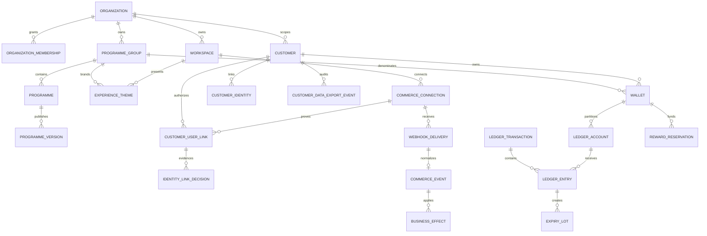

# Data Model

## Implementation status

The tenancy, WooCommerce event/effect, ledger, programme-engine, merchant command/read-model, controlled customer experience, public delivery, authenticated customer link, controlled redemption, customer data export, guided connector provisioning, initial tenant bootstrap, and WooCommerce customer-erasure portions below are implemented in twenty-five versioned migrations. The ledger uses immutable transaction headers/entries, six wallet buckets, programme control accounts, original-attribution lots, signed compensating allocations, same-transaction projections, tenant RLS, and narrow worker commands. Programme publication, materialized tiers/rewards, reward reservations, tier history, evaluation evidence, expiry-notification fences, WooCommerce order/refund effects, native coupon settlement, audited merchant mutations, revisioned experience tokens/copy, customer self-service reads, Auth-derived native-coupon redemption and export, guided WooCommerce provisioning, deployment-only tenant bootstrap, and source-originated identity erasure are implemented.

## Database boundaries

- `loyalty` is the candidate Data API schema. It is not exposed or granted by default. Every table has RLS enabled and forced where ownership permits.
- `loyalty_private` contains privileged functions, webhook bodies, internal queues, projection machinery, and operational metadata. It is never listed in PostgREST schemas and grants nothing to `anon` or `authenticated`.
- `auth` remains owned by Supabase Auth. Starfiniti references `auth.users(id)` but does not edit Auth tables directly.
- `public` contains no Starfiniti tenant tables. Extension objects remain in `extensions`.

## Identifier and tenant strategy

- Internal relational keys use `bigint generated always as identity` for compact indexes and predictable lock ordering.
- Externally visible resources also receive a random UUID `public_id` with a unique constraint. UUIDs are not used as the high-volume clustered primary key.
- High-volume tenant rows store `organization_id` directly. Composite foreign keys such as `(organization_id, wallet_id)` prevent a forged tenant ID from pairing with another tenant's object.
- Every foreign-key column used for joins, RLS, or cascades is indexed. Composite query indexes place equality/tenant columns first and time/range columns last.
- Timestamps use `timestamptz`; monetary amounts use integer minor units (`bigint`); points use signed `bigint`; hashes use `bytea`; bounded states use text plus check constraints.

## Core relationships



## Tenant and access tables

### `organizations`

Security/billing tenant. Suspension blocks new mutations but never hides or deletes balances. Public ID, name, status, created/updated timestamps.

### `organization_memberships`

Unique `(organization_id, user_id)`. Roles are `owner`, `admin`, `operator`, `analyst`, and `auditor`; permissions are mapped in code/database helpers, not taken from user-editable JWT metadata. Revocation has `revoked_at`; sensitive commands check live membership.

### `workspaces`

Operational store/store-group scope. Unique `(organization_id, slug)`. A workspace cannot move organizations; migration requires a controlled copy/relink process.

### `programme_groups`

Explicit wallet-sharing boundary. Cross-workspace sharing is impossible without a membership row connecting a workspace to the group. Unrelated organizations never share a group.

### `support_access_grants`

Time-limited, reason-bound, approved grants for platform support. Stores support actor, target organization, approver, scope, expiry, revocation, and correlation ID. Each use writes an audit event. No permanent impersonation flag exists.

## Programme tables

- `programmes`: mutable identity and lifecycle container within a programme group.
- `programme_versions`: immutable JSON configuration plus canonical SHA-256 hash, version number, status, publication timestamp, and creator/approver. Only one published interpretation applies to a transaction; updates create a new row.
- `programme_tiers` and `programme_rewards`: immutable children of a programme version where relational querying is required. They retain the version ID on historical effects.
- Merchant editing creates a new draft version rather than mutating an existing or historical version. Published versions, tiers, and reward definitions reject update/delete through privilege and trigger guards.

### `admin_audit_events`

Immutable tenant-scoped evidence for administration commands: request-derived actor, action, resource public ID, tenant idempotency key, canonical request hash, correlation ID, bounded metadata, and creation time. Only owners, admins, and auditors can read programme administration evidence through RLS. No authenticated role receives direct insert/update/delete privileges.

### Audiences and campaign targeting

- `audiences`: immutable stable audience code within one organization and programme group.
- `audience_versions`: independently validated allowlisted predicates with immutable draft/published/superseded history, exact definition hash, and one published version per audience.
- `audience_snapshots`: PostgreSQL-timed aggregate evidence for one published version. The browser can inspect bounded counts and history through tenant RLS but cannot supply scope, time, or members.
- `loyalty_private.audience_snapshot_members`: private included customer/wallet keys plus exact condition decisions. It has no browser, anonymous, runtime, connector, or worker grant until a later campaign executor receives a narrower reviewed boundary.

Current audience metrics are derived from wallet balances, immutable tier-qualification facts, active tier intervals, and customer creation evidence. Arbitrary SQL, browser tags, PII predicates, and caller-supplied member lists are not part of the contract. New targeting is gated by the database-authoritative `campaigns` entitlement; rollback preserves versions, completed snapshots, and accepted retry evidence.

- `campaigns`: stable tenant/programme-group identity for one campaign code, bound to the exact programme selected by the authenticated draft command.
- `campaign_versions`: immutable strict behavior, audience/exclusion snapshot references, explicit-instant/IANA schedule evidence, hard effect/points/liability ceilings, aggregate assignment counts/hash, and draft/scheduled/active/paused/cancelled/completed lifecycle.
- `loyalty_private.campaign_controls`: one private 32-byte random assignment salt plus aggregate assignment hash for an approved version.
- `loyalty_private.campaign_assignments`: one immutable eligible wallet/customer treatment-or-control row with its assignment evidence hash. Browser/runtime roles cannot enumerate it.
- `loyalty_private.campaign_capacity_counters`: serialized mutable projections of reserved/committed effects, points, and monetary liability for one immutable campaign version.
- `loyalty_private.campaign_execution_batches`: immutable purchase operation, original candidate context, baseline/final evaluation, and programme-evaluation/transaction evidence used for exact retry.
- `loyalty_private.campaign_effects`: one immutable control, exhausted, suppressed, or awarded decision per matched purchase campaign, with awarded decisions linked to their exact ledger transaction and pending origin entry.
- `loyalty_private.campaign_capacity_allocations`: one-way `reserved -> committed|released` evidence for milestone, win-back, tier, referral, and limited-reward capacity.
- `loyalty_private.campaign_trigger_jobs`: canonical programme-bound milestone, win-back, tier, referral, and limited work with minimized evidence, treatment/control assignment, bounded lease state, and an optional original job for compensation.
- `loyalty_private.campaign_trigger_job_attempts`: immutable claim, retry, lease-expiry, and manual-review evidence, capped at ten attempts.
- `loyalty_private.campaign_trigger_executions`: immutable source-to-capacity-to-ledger-or-native-reservation outcomes, including zero-value control/exhaustion and linked compensation evidence.

Approval materializes inclusion minus exclusions and the treatment/control split in one transaction before a version becomes scheduled. One accepted-version partial unique index prevents overlap for a stable campaign. Purchase execution locks operation, member, and campaign capacity in a stable order; reserves capacity; calls the existing programme award boundary; appends separately attributed campaign awards; and commits counters in one transaction. Original context is replayed on exact retry.

Canonical qualification, tier, referral, and limited-assignment facts enqueue private programme-bound work. The worker receives only bounded scheduling, claim, execution, and retry functions. One execution transaction verifies the lease/evidence, reserves capacity, appends point value or a campaign-funded native reward reservation, and records immutable completion. Definitive native cancellation compensates internal campaign funding; ambiguous outcomes retain reservations and committed capacity for inspection. Entitlement disablement stops new issue jobs but preserves accepted jobs and reversals.

### `experience_themes`

Unique per `(organization_id, workspace_id, programme_group_id)` and protected by a composite foreign key to the explicit workspace/group link. Each revision stores one accessible canonical brand color, an allowlisted local font token, bounded radius and copy, section visibility, and widget side. It stores no CSS, markup, scripts, URLs, uploads, customer attributes, or secrets. Members can read through RLS; only the guarded owner/admin command can create or revision a row and append matching immutable audit evidence.

## Customer and identity tables

- `customers`: organization-scoped person/pseudonymous subject record; it is not keyed by email.
- `customer_identities`: unique `(commerce_connection_id, external_customer_id)`, with verified channel facts and optional guest-order identity. Email/phone are encrypted or separately protected attributes, never unique merge keys.
- `customer_user_links`: revocable verified link from one Auth user to one customer inside an organization. Partial unique indexes enforce one active customer per Auth user and one active Auth user per customer; identity fields cannot be rewritten and revocation cannot be undone in place.
- `identity_link_decisions`: append-only claim evidence keyed by connection and one-use nonce/proof hashes. It stores the Auth subject, optional resolved customer, key version, issue time, outcome, and SHA-256 references—not raw nonce, signature, email, or external customer ID.

`get_my_loyalty_accounts()` derives the Auth subject from the live request and accepts no input arguments. It returns at most 20 active linked accounts with exact text-form wallet balances, minimized tier/expiry state, up to 20 safe published rewards, ten active reservations, and ten redacted ledger activities. Underlying link, identity, ledger, and decision tables remain unavailable to browser roles.

`redeem_my_reward(account_public_id, reward_code, request_id)` accepts only one linked-account public ID, a published reward code, and a request UUID. It derives the Auth subject, organization, customer, active programme version, wallet, exact points cost, coupon validity, and source WooCommerce connection inside one security-definer transaction. Creation, FIFO-backed ledger reserve, reserved transition, and private coupon outbox enqueue either all commit or all roll back. Exact retries return the original reservation; changed reuse, insufficient balance, cross-tenant scope, revoked links, blocked wallets, inactive workspaces/connections, and unsupported reward kinds fail closed. Coupon code and external WooCommerce customer ID never enter the browser result.

`loyalty_private.customer_data_export_authorizations` stores only a SHA-256 capability digest, verified Auth subject, Supabase session ID, five-minute expiry, and one-use timestamp. The trusted Next.js runtime issues the random capability only after password reauthentication. `consume_customer_data_export` locks and consumes it atomically, rechecks the subject/session and every active customer-link/tenant/workspace/connection boundary, and builds one versioned JSON document without accepting organization, customer, or wallet selectors. Export content is returned directly over TLS and is never stored in PostgreSQL or object storage.

`loyalty_private.provision_woocommerce_connection` is executable only by the dedicated application runtime role. It accepts a verified Auth actor plus public workspace/programme selectors and one deployment-selected `pool:<uuid>:v1` reference, then independently rechecks live owner/admin membership, active linked scope, and a published programme before creating an active v1 connection and immutable audit event. A unique index prevents reference reuse. Authenticated Data API clients receive column-level access to safe connection fields only; `signing_material_ref` remains outside browser grants and audit metadata.

`loyalty_private.customer_data_export_events` is immutable per-included-customer audit evidence containing the export ID, customer and organization scope, Auth subject, session, generation time, and document schema version. It contains no exported payload, Auth email, capability, signing reference, actor evidence, request body, or commerce secret. Both export tables and functions are private and executable only by the runtime role.

Identity linking is described in `IDENTITY_MODEL.md`.

`loyalty_private.customer_privacy_cases` stores immutable connection-bound HMAC fingerprints and opaque case references only. Per-connection 256-bit peppers are isolated in a separate no-grant private table. `apply_woocommerce_customer_erasure` accepts only the leased canonical deletion event, pseudonymizes the matching channel identity, revokes active hosted links, clears the display reference, scrubs the restricted canonical/raw event to its case ID, and leaves wallets and immutable ledger history intact. The same keyed tombstone makes later channel resolution return `suppressed` without creating another customer.

## Wallet and double-entry ledger

### `wallets`

Unique `(programme_group_id, customer_id)`, plus organization ID enforced through composite keys. Wallet status may prevent new spend but never erases history.

### `ledger_accounts`

Accounts represent wallet buckets (`pending`, `available`, `reserved`) and programme control/contra accounts (`issuance`, `redeemed`, `expired`, `reversal`). Each account belongs to one organization/programme group; wallet accounts additionally belong to one wallet. Unique constraints prevent duplicate bucket accounts.

### `ledger_transactions`

Immutable operation header containing organization, programme group/version, kind, actor type/ID, source event, source reference, tenant-scoped idempotency key, canonical request hash, correlation ID, effective time, and creation time.

Unique `(organization_id, idempotency_key)` guarantees one operation result. Reusing a key with a different request hash raises a conflict. There is no update/delete grant.

The posting primitive reserves an identity value, inserts entries under a deferred composite transaction foreign key, then inserts the header. An immediate constraint trigger validates entry count and zero sum, so no mutable draft/post transition is required.

### `ledger_entries`

Immutable signed point quantity against one account. Each transaction has at least two entries and the sum of all entries is exactly zero before commit. Entry organization/programme group must match both transaction and account through composite foreign keys. Zero entries are rejected.

Examples:

- Award: programme issuance `-500`, wallet pending `+500`.
- Release: wallet pending `-500`, wallet available `+500`.
- Reserve: wallet available `-500`, wallet reserved `+500`.
- Capture: wallet reserved `-500`, programme redeemed `+500`.
- Refund reversal: wallet pending/available `-x`, programme reversal `+x`; an available account may become negative only through the approved reversal command.

### `wallet_balances`

Mutable, rebuildable projection keyed by wallet/account bucket. It is updated in the same transaction as ledger entries and checked against integer bounds. It is never accepted as independent evidence; a rebuild from entries must reproduce it exactly.

Implemented wallet buckets are `pending`, `available`, `reserved`, `spent`, `expired`, and `reversed`. Programme-group control accounts are `issuance` and `adjustment`.

### `expiry_lots` and `redemption_allocations`

An available credit creates an immutable lot linked to its credit entry, programme version, `available_at`, and `expires_at`. Redemptions allocate immutable quantities to lots in `(expires_at, available_at, id)` order. Remaining quantity is a projection; concurrent operations lock candidate lots in that same order.

## Commerce and idempotency tables

- `commerce_connections`: workspace-scoped WooCommerce installation, explicit programme binding, status, endpoint metadata, unique credential reference, signing-key version, health/reconciliation watermark. Secrets live in the deployment secret store, not rows; browser column privileges exclude the credential reference.
- `webhook_deliveries` (`loyalty_private`): raw verified body bytes, body hash, headers allowlist, signature-key version, delivery/source IDs, receipt time, processing status, and retention deadline. Unique `(connection_id, source_delivery_id)`.
- `commerce_events`: canonical versioned fact with source aggregate ID, source version/modified time, occurred time, canonical payload/hash, normalization version, durable effect lease/attempt state, and bounded failure code.
- `business_effects`: unique `(organization_id, event_id, effect_kind, effect_key)` linking an event to the ledger/audit result.
- `outbox_messages`: transactionally written command/event with availability, attempts, lease, opaque native result, and dead-letter state. WooCommerce issue/cancel commands are unique per reservation and topic; consumers are idempotent.
- `reconciliation_runs/items`: source range, counts, mismatches, repairs, operator, and evidence.

Raw bodies are restricted and short-lived; canonical facts and hashes retain enough evidence to explain effects after raw-body deletion.

The merchant Data API does not receive privileges on private queue tables. Exact-signature connector operation wrappers aggregate counts and project a bounded issue allowlist after a live membership check. The only merchant queue mutation is a reason-bound `dead_letter -> retryable` transition for a canonical effect, guarded by owner/admin/operator membership and an `admin_audit_events` row. Generic outbound coupon-command retry is absent because reservation compensation may already have occurred.

## Reward reservation state

`reward_reservations` uses an enforced transition graph:

```text
requested -> reserved -> issued -> captured
                 |          |
                 +-> cancelled/expired/failed
                            |
                            +-> released (compensating ledger transaction)
```

The reservation holds programme version, wallet, reward, points, expiry, idempotency key, and an opaque connector execution reference. `reward_reservation_transitions` preserves every state change and binds each value-bearing change to one unique same-wallet ledger transaction. Coupon plaintext is transmitted only in the private connector outbox and is not persisted in the reservation boundary or coupon-capture event. WooCommerce capture and confirmed-unused cancellation both lock the reservation; capture and compensating release remain mutually exclusive ledger effects.

## Tier history and audit

- `tier_decisions` stores append-only qualification, transition, grace, programme-version, idempotency, and explanation evidence.
- `tier_memberships` stores effective tier intervals and the decision that opened each interval. Closing the current interval and opening the next is atomic.
- `programme_evaluations` stores immutable live/simulation/tier-review input and result hashes plus explanation evidence.
- `programme_referral_policies` materializes the immutable attribution, qualifying status, minimum spend, cooling, give/get, and bounded risk policy for each V2 version. `referral_advocates` binds one opaque code to a database customer/programme group; it is not authorization.
- `referral_attributions` stores one serialized friend/programme-group first attribution. `referral_attribution_transitions` is the append-only captured/review/blocked/cooling/qualified/rejected/reversed state history.
- Private `referral_qualification_facts` binds one canonical status event and one historical `referral_qualification` evaluation to exact eligible spend, database-derived first-paid-order evidence, decision, event time, and cooling deadline. Qualification is value-neutral.
- Private `referral_reward_jobs` leases due cooling work in bounded ten-attempt cycles with cumulative attempt identity, at most four audited merchant-reviewed requeues, and a 50-attempt hard ceiling. `referral_reward_issuances` binds one qualified referral to both evaluation/award/release/tier-fact chains; `referral_reward_compensations` binds one canonical refund to both reversal chains. Accepted jobs continue independently of rollout entitlement, and all tables are inaccessible to browser/runtime roles.
- `get_my_referral_experiences_v1()` is a no-selector Auth-derived customer projection over published policy and immutable current-state/history facts. `get_referral_dashboard_v1(programmeId, lookbackDays)` is a tenant-role-derived merchant projection over canonical attribution, transition, and issuance facts. Neither grants raw-table access or value authority; customer, merchant-performance, and review reads degrade independently.
- `audit_events` is append-only and records organization, actor, support grant, action, object type/ID, before/after metadata without secrets/PII, IP classification, correlation ID, and timestamp.
- `manual_adjustment_requests` requires reason, evidence, requester, approver where policy requires, and the resulting compensating ledger transaction.
- `admin_audit_events` currently records initial tenant bootstrap, programme creation/draft/publication/scheduling, connector operations, customer adjustments, experience-theme revisions, referral risk decisions, and reviewed referral-job recovery with an attributable Auth principal, canonical request hash, idempotency key, correlation ID, resource ID, and minimized metadata. Bootstrap identifies the newly approved owner under deployment-owner authority; normal merchant commands derive their actor from the live Auth request. Rows are immutable; owner/admin/auditor reads remain tenant scoped.
- Merchant customer adjustment resolves an active wallet plus exact published programme version under a live owner/admin check, then appends `manual_adjustment` entries between the programme-group adjustment control account and wallet available account. Credits create expiring lots; debits append FIFO adjustment allocations for existing lots and may leave an explicit negative available balance. The matching `admin_audit_events` row links its command correlation to the immutable ledger correlation.
- `bulk_adjustment_batches` retains the immutable owner/admin request, exact preview and request hashes, uniform signed amount, aggregate count/total, published programme attribution, actor, idempotency key, and correlation ID. `bulk_adjustment_items` links each batch customer/wallet to exactly one immutable ledger transaction plus the locked before/after available projection. Both tables use composite tenant foreign keys, RLS-scoped privileged reads, no browser DML, and immutable triggers.
- `experience_translations` stores one current revision of bounded customer-facing copy per linked workspace/programme group and locale. The launch runtime/editor use only `en`; the released `sl-SI` key remains for migration compatibility and is non-selectable. The table is separate from theme tokens and customer identity, uses composite tenant keys plus member-read RLS, allows no direct browser DML, and appends minimized immutable locale/revision audit evidence for every owner/admin save.
- `get_public_loyalty_experience` is a read-only anonymous projection, not a public table policy. It resolves one active workspace/programme-group link and current published programme, caps tiers at 12 and rewards at 20, emits exact bigint values as text plus approved theme/copy fields, and excludes organization identity, customers, ledgers, raw configuration, reward configuration, audit, integrations, and commerce evidence.
- Merchant Overview reporting is a read model, not a mutable analytics truth table. It joins one authorized workspace/programme scope to scoped wallets, immutable live evaluation evidence, and wallet-side ledger/projection rows; returns exact text-form aggregates and bounded UTC daily buckets; and withholds private evaluation, commerce, identity, and ledger evidence.

## Deployment and entitlement authority

- `entitlement_catalogue` is immutable, versioned capability metadata with separate self-hosted/managed defaults, optional exact limits, and a structural protected-value flag.
- `deployment_configuration_versions`, `capability_rollout_versions`, and `entitlement_provider_price_versions` are private append-only operational evidence. Provider IDs never grant capability access and never leave the private schema.
- `organization_entitlements` is append-only tenant evidence for local control, contracts, billing, manual overrides, and named canaries. RLS exposes only rows for a live member's tenant and grants no browser DML.
- Effective resolution orders protected value paths first, an explicit tenant decision second, deployment default third, and a deterministic stable-subject percentage rollout last. Balance reads, refunds, reconciliation, checkout independence, exports, and promised redemption always resolve enabled.
- Deployment administration writes through private functions unavailable to browser, runtime, and worker roles. The merchant read model accepts a public selector but independently derives access from live membership; exact bigint limits cross the API as text.

## RLS and privileges

- All `loyalty` tables enable RLS. Tenant policies specify `TO authenticated`, wrap stable helpers such as `(select auth.uid())`, and use indexed organization/customer link lookups.
- Complex membership helpers live in `loyalty_private`, are `security definer`, have empty search paths, and return only booleans/IDs needed by policies.
- `anon` has no Starfiniti table privileges. `authenticated` gets explicit read or safe self-service privileges only.
- Backend roles execute commands; they do not receive blanket table DML. Table owners are `NOLOGIN` and normal queries are tested without owner bypass.
- Exposed views use `security_invoker = true` and contain no hidden cross-tenant joins.
- Phase 3 tests enumerate all candidate/exposed tables, verify RLS/grants, impersonate two organizations and a revoked user, forge tenant IDs, and confirm fail-closed behavior.

## Transaction and concurrency rules

- No network call occurs inside a database transaction.
- Wallets/lots are locked in ascending ID/expiry order. Transactions remain short and have local statement/lock timeouts.
- Insert-or-ignore/upsert patterns rely on unique constraints, never `SELECT`-then-`INSERT` races.
- Redemption, capture, reversal, referral two-sided issue/compensation, tier transition, and event effect each use one database transaction.
- Deadlocks are safe to retry only with the same idempotency key and canonical request hash.

## Retention and deletion

Ledger, programme versions, business effects, approvals, and audit evidence follow the legal/financial retention policy and are pseudonymized rather than destroyed when required for integrity. Contact attributes and raw webhook bodies have shorter explicit retention. Privacy deletion severs or pseudonymizes identity links without deleting unexplained value changes.

## Migration order

1. Roles/helpers and tenant tables.
2. Membership, RLS, grants, and adversarial tests.
3. Programmes/customers/identities.
4. Inbox/outbox and canonical events.
5. Ledger/accounts/projections with invariant tests.
6. Reservations, tiers, audit, and privacy workflows.

Each migration is forward compatible with the previous application version. Destructive changes use expand/migrate/contract and verified backup/restore evidence.
