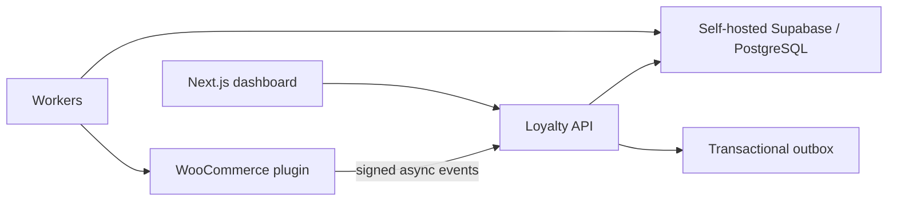

# System Architecture

The system begins as a modular monolith. PostgreSQL is authoritative. Supabase supplies open-source Auth, PostgREST, Realtime, Storage, and administration where useful, but privileged ledger operations remain server-side transactions. The WordPress plugin persists an outbound queue and degrades safely when the central system is unavailable.
