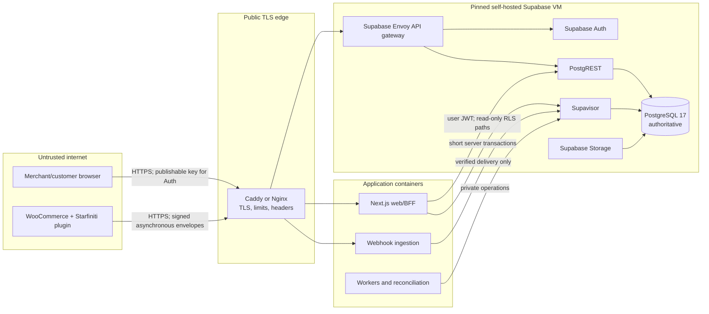

# System Architecture

## Architecture outcome

Starfiniti Loyalty is a modular monolith with one authoritative PostgreSQL database. Supabase supplies Auth, PostgREST, Realtime, Storage, Studio, Supavisor, and the Envoy API gateway where they add value. The Next.js application, API handlers, and workers share versioned domain and database packages, but run as separately scalable processes.

WooCommerce remains a non-authoritative connector. It owns commerce records and native coupons; Starfiniti owns programme versions, identities, wallets, ledger entries, reservations, tier history, and loyalty audit history.

## Trust boundaries



Every arrow crossing a box boundary is authenticated, authorized, encrypted in transit outside the private network, rate-limited where public, and correlated with a request or event ID.

## Runtime components and authority

| Component          | May do                                                                                                       | Must not do                                                                                                  |
| ------------------ | ------------------------------------------------------------------------------------------------------------ | ------------------------------------------------------------------------------------------------------------ |
| Browser            | Authenticate with a publishable key; render authorized data; submit commands to the BFF                      | Receive secret/service keys; decide tenant scope; write ledger tables                                        |
| Next.js web/BFF    | Validate Supabase sessions; enforce CSRF/origin controls; call authorized reads and private commands         | Trust client-supplied organization IDs; hold database locks across network calls                             |
| Webhook ingestion  | Bound request size; locate connection; verify HMAC over raw bytes; persist accepted delivery; return quickly | Parse or enqueue an unverified body; create points synchronously in the request                              |
| Worker             | Normalize events; run idempotent domain commands; publish outbox work; reconcile sources                     | Make an external call while holding a database transaction; rewrite ledger history                           |
| WooCommerce plugin | Persist local outbox; sign deliveries; execute native coupons idempotently; show cached loyalty UI           | Become the balance source of truth; receive a database/service-role credential; block checkout on hub outage |
| Postgres           | Enforce tenant keys, RLS, idempotency, ledger balance, immutability, and state transitions                   | Infer tenant identity from untrusted input; store plaintext external secrets                                 |

## Database access roles

- `anon` receives no Starfiniti schema privileges.
- `authenticated` receives only explicit `SELECT`/`EXECUTE` privileges required by RLS-protected read models. It never receives direct ledger or inbox DML.
- `loyalty_runtime` is a server-only login through Supavisor. It has no table ownership, `BYPASSRLS`, superuser, schema-creation, or unrestricted DML. It may execute a narrow set of private command functions.
- `loyalty_worker` is separately credentialed and may execute worker/reconciliation functions. It cannot administer Auth, roles, or extensions.
- `loyalty_owner` is a `NOLOGIN` migration/ownership role. Privileged functions are owned by it, use `security definer`, set `search_path = ''`, schema-qualify every object, and revoke `PUBLIC` execution.
- Infrastructure administration uses a break-glass path outside normal application credentials and is always audited operationally.

Supabase secret keys and the legacy service-role key are reserved for narrowly justified administration. They are not normal application database credentials and never enter browsers, WordPress, logs, or support bundles.

## Module dependency rules

```text
apps/dashboard  ─┬─> packages/contracts
                 ├─> packages/domain
                 └─> packages/database

future api/workers ─> contracts + domain + database
woocommerce plugin ─> versioned HTTP contract only

domain      -> no framework, network, database, or platform dependency
contracts   -> schemas and wire compatibility only
database    -> transactions, repositories, migrations, and generated types
connectors  -> normalize platform facts; no loyalty rule ownership
```

Circular dependencies are forbidden. Platform adapters translate at the edge; domain rules never import WooCommerce, Supabase, or Next.js.

## Request paths

### Merchant read

1. Browser presents a short-lived Supabase access token to the BFF.
2. BFF validates the session and derives the user ID; it never accepts membership from `user_metadata`.
3. Query runs through an RLS-protected read path. Membership is checked from database rows, not stale JWT organization claims.
4. Response is minimized and cache headers prevent private shared caching.

### Balance-affecting command

1. BFF validates session, permission, request schema, and idempotency key.
2. It calls one private database command with the verified actor and correlation context.
3. The command rechecks membership/permission, locks affected wallets in ascending ID order, validates programme version, inserts a balanced immutable transaction, updates rebuildable projections, writes audit and outbox rows, and commits.
4. External effects happen only after commit.

### WooCommerce delivery

1. Plugin writes a local outbox row before attempting delivery.
2. Ingestion verifies connection status, timestamp/nonce policy, and HMAC over raw bytes before JSON processing.
3. An accepted delivery is inserted once and acknowledged; duplicates return the original receipt result.
4. Workers normalize and apply effects idempotently. Late facts remain visible and reconciliation repairs controlled gaps.

## Availability and failure rules

- Store checkout, order creation, and payment never synchronously depend on Starfiniti.
- Dashboard mutations fail closed when authorization or the database is unavailable; safe reads may show explicitly stale cached data.
- Plugin events remain in the WordPress outbox with exponential backoff and operator-visible age/error state.
- Workers use bounded retries, dead-letter quarantine, replay authorization, and per-connection reconciliation watermarks.
- Redis/Valkey may later accelerate replaceable locks or rate limits, but PostgreSQL constraints remain authoritative.
- Realtime and Storage are optional for the first ledger release. Their absence cannot affect balance correctness.

## Self-hosted deployment boundary

- Supabase and application processes are separate container groups; application rollback does not roll back Postgres.
- Envoy is the Supabase default gateway as of August 2026 and exposes plain HTTP only inside the trusted network. Caddy/Nginx terminates public TLS.
- `API_EXTERNAL_URL` includes `/auth/v1`; `SUPABASE_PUBLIC_URL`, `SITE_URL`, and redirect allowlists are explicit.
- Supavisor transaction mode is used for short application transactions; migrations and operational sessions use direct/session mode.
- Analytics/Vector are opt-in and are not required for correctness. Production observability must not depend only on Studio logs.
- All images and the upstream self-hosted release are pinned as one tested set. PostgreSQL major upgrades use upstream procedures and restore rehearsal, never an in-place image-tag guess.

## Architecture gate

No critical threat lacks a designed control, owner, implementation phase, and verification path. Phase 3 may implement tenancy and RLS without inventing authority or identity rules. Later phases must not weaken these boundaries without a superseding ADR.
